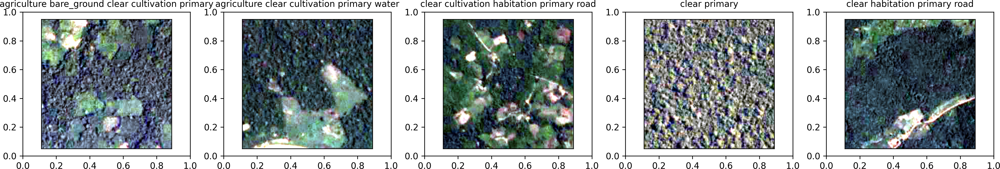

## Planet: Understanding the Amazon from Space 🌳🛰️
#### Use satellite data to track the human footprint in the Amazon rainforest

#### Goal:
to tag satellite data chips with information on atmospheric conditions and land use/land cover by performing image multioutput classification

#### Data:
- 3-band, 8-bit satellite data chips of size 256x256 pixels, being parts of Planet's '*visual product*' created based on imagery from ISS and Flock 2 satellite, characterized by GSD of app. 3.7 m, saved in *.jpg* format [1]
- training data annotation *.csv* file [1]

#### Study area and time:
data collected:
- over '*Amazon basin which includes Brazil, Peru, Uruguay, Colombia, Venezuela, Guyana, Bolivia, and Ecuador*' [1]
- '*between January 1, 2016 and February 1, 2017*' [1]

#### Processing steps:
part 1: EDA and data pre-processing
1. Downloading the source data using Kaggle API and unzipping it
2. Analyzing the training annotation file
3. Analyzing the training images

part 2: Baseline model
1. Feature engineering
2. Stratified training/validation data split
3. Classification
4. Accuracy assessment

part 3: PyTorch CNN models - in progress

